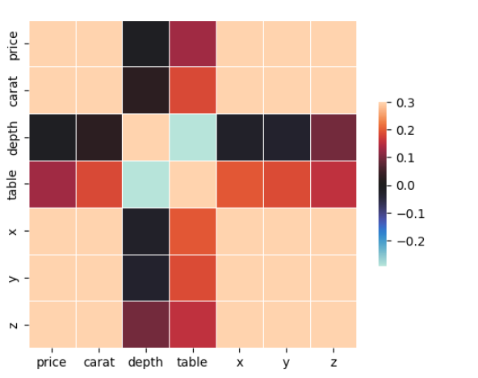
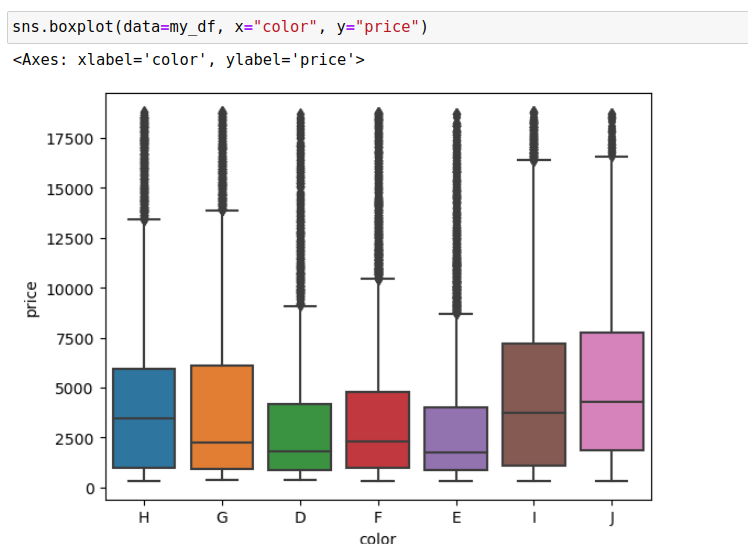

# Diamond Price Prediction

This repository contains a machine learning model for predicting diamond prices. The project includes exploratory data analysis (EDA), data preprocessing, feature engineering, label encoding, and utilizes the GradientBoost model with grid search for optimal hyperparameter tuning.

## Table of Contents

- [Introduction](#introduction)
- [Dataset](#dataset)
- [EDA](#EDA)
- [Preprocessing](#Preproccesing)
- [Feature Engineering](#FeatureEngineering)
- [Feature Engineering](#GradientBoostModel)
- [Feature Engineering](#GridSearch)

## Introduction

The aim of this project is to develop a machine learning model that accurately predicts the price of diamonds based on their various features. By leveraging the power of GradientBoost algorithm and performing grid search for hyperparameter tuning, we strive to achieve the best possible performance.

The project consists of several stages, including exploratory data analysis to gain insights into the dataset, data preprocessing to handle missing values and normalize features, feature engineering to create new meaningful features, label encoding to convert categorical variables into numerical representations, and training the GradientBoost model using grid search for hyperparameter optimization.

## Dataset

The dataset used for this project is the Diamond Dataset, which includes various attributes of diamonds such as carat weight, cut quality, color, clarity, dimensions, and price. The dataset is not included in this repository, but it can be obtained from a reliable source such as Kaggle or a diamond data provider.

## EDA

Before building the machine learning model, it is essential to gain insights into the diamond dataset through exploratory data analysis (EDA). The EDA helps us understand the relationships between the features and the target variable, identify patterns, and uncover any anomalies or outliers in the data.

To perform the EDA, we use the `pandas`, `matplotlib`, and `seaborn` libraries in Python. Here's a summary of the EDA steps and visualizations:

- Loading the Dataset:
  - The diamond dataset is loaded from a .db file named 'diamonds_train.db' located in the 'data/' directory.
  - The first few rows of the dataset are displayed to get a glimpse of the data.

- Summary Statistics:
  - The `describe()` function is used to compute summary statistics such as count, mean, standard deviation, minimum, and maximum values for each numerical column in the dataset.
  - These statistics provide an overview of the distribution and range of values in the dataset.

- Correlation Matrix:
  - The correlation matrix is calculated using the `corr()` function from `pandas`.
  - A heatmap is created using `seaborn` to visualize the correlations between different features.
  - This visualization helps identify strong positive or negative correlations between features, which can indicate important relationships in the dataset.
    
  

- Box Plot: Color vs. Price:
  - A box plot is created using `seaborn` to analyze the relationship between the color of the diamonds and their prices.
  - The box plot displays the distribution of prices for different diamond colors.
  - It helps identify any significant price differences based on the cut quality.
  - This step is done with all the categorical variables, here is the example with 'colors' feature.
  
  

The EDA process provides valuable insights into the dataset, enabling us to make informed decisions during preprocessing, feature engineering, and model selection. Feel free to explore and modify the EDA code to suit your specific requirements and gain a deeper understanding of the diamond dataset.

## Preprocessing

In the preprocessing step, outliers are handled to ensure they do not negatively impact the model's performance. Outliers are data points that deviate significantly from the majority of the data and can introduce noise or bias in the model's predictions.

Analyze the numerical features to identify potential outliers using statistical methods or visualization techniques. In the previous image you can see some of them.

## Enlabel

In the diamond price prediction project, label encoding is applied to handle categorical variables. Label encoding is a process of converting categorical values into numerical representations, allowing machine learning models to work with categorical data effectively.

Label encoding enables the machine learning model to understand and process categorical variables as numerical inputs. However, it is important to note that label encoding introduces an inherent ordering or ranking among the categories, which may not always be appropriate or desired. In such cases, other encoding techniques like one-hot encoding or target encoding can be explored.

## FeatureEngineering

Feature engineering is the process of creating new meaningful features or transforming existing features to improve the performance and predictive power of machine learning models. In the diamond price prediction project, we perform feature engineering to derive two new variables:

Ratio of X and Y:

We create a new feature by dividing the values of variable X by variable Y.
This ratio represents a relative measurement that captures the proportion between two dimensions of the diamond.
Carat-Depth-Vtable Interaction:

Another new feature is created by multiplying the carat value with the ratio of depth and vtable variables, i.e., (carat / depth) * table.
This interaction term incorporates the carat weight of the diamond along with its depth and table measurements, potentially capturing interesting relationships among these attributes.
By introducing these new variables, we aim to enhance the predictive capability of our machine learning model by incorporating additional information and potential interactions between existing features. These engineered features can help the model capture non-linear relationships and improve its ability to predict diamond prices accurately.

Feature engineering is a crucial step in machine learning projects as it allows us to extract valuable insights and leverage domain knowledge to create more informative features. It is an iterative process that involves experimentation, domain expertise, and understanding the underlying relationships in the data.

## GradientBoostModel

The GradientBoost model is a powerful machine learning algorithm that belongs to the ensemble learning family. It combines multiple weak prediction models, typically decision trees, to create a stronger and more accurate predictive model. GradientBoosting is based on the principle of boosting, where each subsequent model in the ensemble is trained to correct the errors made by the previous models.

Key characteristics of the GradientBoost model include:

Boosting: The model sequentially builds an ensemble of weak learners, where each subsequent model focuses on correcting the mistakes made by the previous models.
Gradient Descent: It utilizes gradient descent optimization to minimize a loss function, such as mean squared error (MSE) or log loss, during the training process.
Gradient Calculation: The model calculates gradients of the loss function with respect to the predicted values, enabling it to update subsequent models to minimize the overall loss.
Feature Importance: GradientBoost provides a measure of feature importance, allowing you to identify the most influential features in predicting the target variable.
The GradientBoost model is known for its ability to handle complex non-linear relationships, handle different types of data, and effectively handle outliers and missing values. It often delivers strong predictive performance, making it a popular choice for a wide range of regression and classification tasks.

## GridSearch

GridSearch is a technique used for hyperparameter tuning in machine learning models. Hyperparameters are configuration settings that are not learned from the data but are set before training the model. GridSearch automates the process of systematically searching through a predefined set of hyperparameter values to find the combination that yields the best model performance.

Key features of GridSearch include:

Hyperparameter Space: Define a grid or a list of hyperparameter values to explore for each hyperparameter of the model.
Cross-Validation: GridSearch typically uses cross-validation to evaluate the performance of each hyperparameter combination. It partitions the training data into multiple subsets, trains and validates the model on different subsets, and calculates the average performance.
Evaluation Metric: Specify an evaluation metric, such as accuracy or mean squared error, to determine the best hyperparameter combination based on the model's performance.
Selection Criteria: GridSearch selects the hyperparameter combination that optimizes the evaluation metric, providing the best-performing model configuration.
By exhaustively searching through the hyperparameter space, GridSearch helps to identify the optimal combination of hyperparameters, leading to improved model performance. It saves time and effort by automating the search process and allows you to fine-tune your model for the specific problem at hand.
